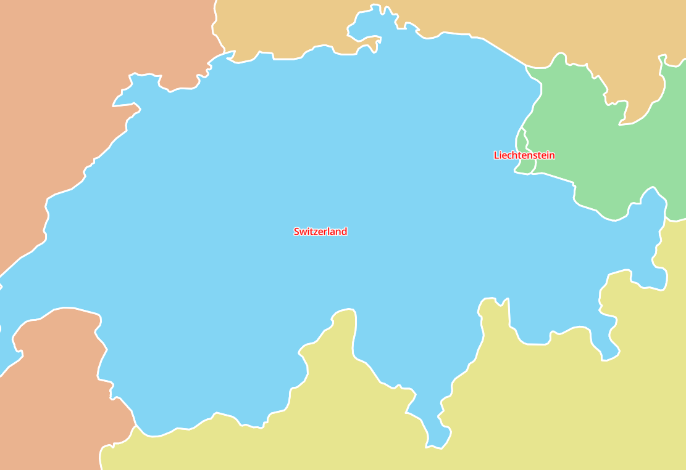
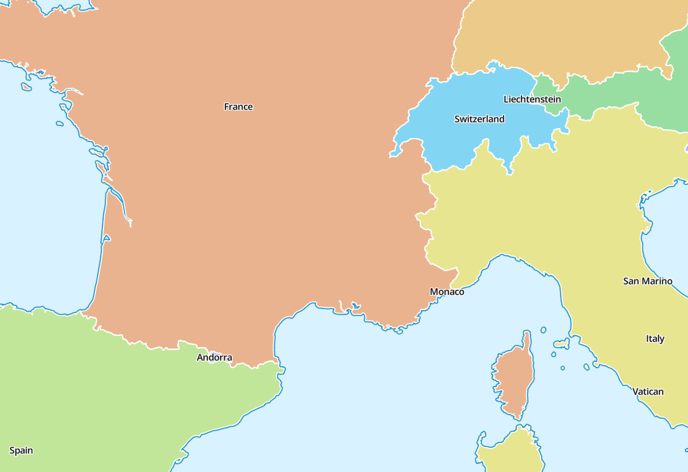

# local-style
Give a MapLibre GL JS map a style which depends on the location.

In the demo at https://wipfli.github.io/local-style/, the map show text labels in black. But when you zoom into Switzerland, the text is shown in red.

